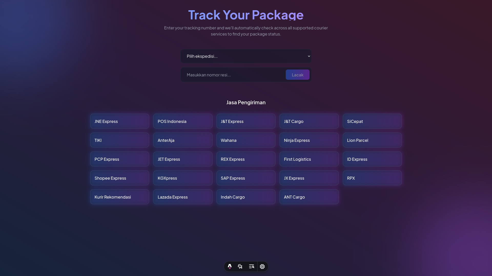

# PaketKu - Sistem Pelacakan Paket Modern



PaketKu adalah aplikasi web pelacakan paket yang modern dan mudah digunakan, dibangun dengan Astro dan TailwindCSS. Aplikasi ini memungkinkan pengguna untuk melacak paket mereka dari berbagai jasa kurir dalam satu platform yang terintegrasi.

## 🚀 Fitur Utama

- 📦 Pelacakan otomatis untuk semua kurir yang didukung
- 🎯 Antarmuka pengguna yang modern dan responsif
- ⚡ Performa tinggi dengan Astro
- 🔒 Keamanan API key yang terjamin
- 📱 Tampilan yang responsif untuk semua ukuran layar
- 🌈 Animasi dan transisi yang menarik
- 🔄 Timeline status pengiriman yang interaktif

## 📋 Prasyarat

Sebelum memulai, pastikan Anda telah menginstall:

- Node.js (versi 20.x atau lebih baru)
- npm atau yarn atau pnpm

## 🛠 Instalasi

1. Clone repositori ini
```bash
git clone https://github.com/HasanH47/paketku.git
cd paketku
```

2. Install dependensi
```bash
npm install
# atau
yarn install
# atau
pnpm install
```

3. Buat file `.env` di root direktori dan tambahkan API key Anda
```env
API_KEY=your_api_key_here
PUBLIC_BASE_URL=https://example.com
```

4. Jalankan server development
```bash
npm run dev
# atau
yarn dev
# atau
pnpm dev
```

## 🔧 Konfigurasi

### Environment Variables

Buat file `.env` di root direktori proyek Anda dan tambahkan variabel berikut:

```env
API_KEY=your_api_key_here
PUBLIC_BASE_URL=https://example.com
```

Anda bisa mendapatkan API key dari [BinderByte](https://binderbyte.com/).

## 📦 Struktur Proyek

```
/
├── public/
├── src/
│   ├── components/
│   │   ├── TrackingForm.astro
│   │   ├── TrackingResult.astro
│   │   └── SupportedCouriers.astro
│   ├── layouts/
│   │   └── Layout.astro
│   ├── pages/
│   │   ├── api/
│   │   │   └── track.ts
│   │   │   └── courier.ts
│   │   └── index.astro
│   ├── stores/
│   │   └── couriers.ts
├── astro.config.mjs
├── package.json
├── README.md
└── tsconfig.json
```

## 🎯 Penggunaan

1. Buka aplikasi di browser
2. Masukkan nomor resi pengiriman Anda
3. Sistem akan otomatis mencari di semua layanan kurir yang didukung
4. Hasil pelacakan akan ditampilkan dalam timeline yang interaktif

## 📱 Screenshot


*Halaman Utama*

## 🛠 Teknologi yang Digunakan

- [Astro](https://astro.build) - Framework web modern
- [TailwindCSS](https://tailwindcss.com) - Framework CSS
- [TypeScript](https://www.typescriptlang.org/) - JavaScript dengan type system
- [BinderByte API](https://binderbyte.com) - API pelacakan paket

## 🤝 Kontribusi

Kontribusi selalu diterima dengan senang hati! Berikut adalah cara untuk berkontribusi:

1. Fork repositori
2. Buat branch fitur baru (`git checkout -b fitur-keren`)
3. Commit perubahan Anda (`git commit -m 'Menambahkan fitur keren'`)
4. Push ke branch (`git push origin fitur-keren`)
5. Buat Pull Request

## 📝 Lisensi

Proyek ini dilisensikan di bawah Lisensi MIT - lihat file [LICENSE](LICENSE) untuk detail.

## 🙏 Pengakuan

- Terima kasih kepada [BinderByte](https://binderbyte.com) untuk API pelacakan paket
- Terima kasih kepada komunitas open source untuk semua tools dan library yang digunakan

## 📞 Kontak

Jika Anda memiliki pertanyaan atau saran, jangan ragu untuk:
- Membuat issue di repositori ini
- Mengunjungi [website kami](https://hasanh.dev)